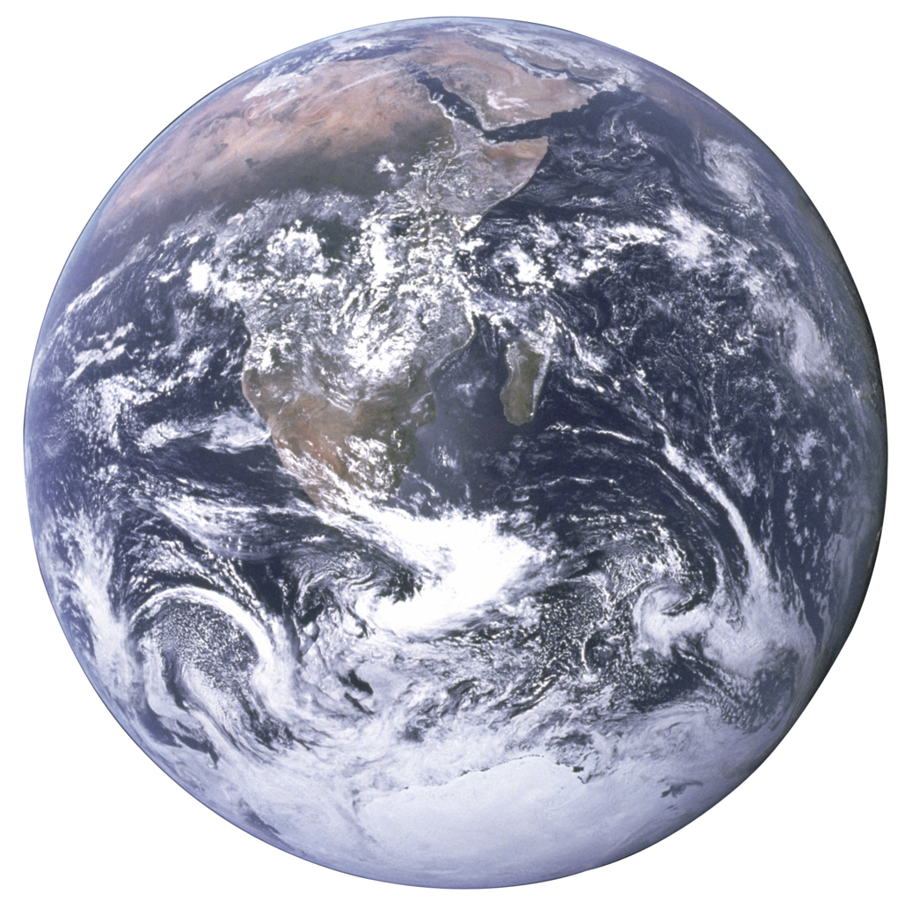

# Astrophysicist and Mathematician

 
     
     
     
     
     
     
     
     
    

 

#### You can download my resume [here](assets/graham_resume.pdf)

 

## Skills
- **Programming Software**: Java, MATLAB, Python, C++, CSS, HTML, some R
- **Engineering Software**: CATIA, AutoDesk Inventor, various PASCO interfaces
- **Languages**: Spanish (Conversational), ESL (Basic)
- **Data Analytics**: Regression, Data visualization, Statistical Analysis, Predictive Modeling.
- **Public Outreach**: Multi-media Presentations (i.e. Science on a Sphere, Hyperwalls, etc.)
- **Laboratory**: Microscopy, Field Sampling, Microbial Cultivation, SOP Developments.

 

## Education
- B.S. Astrophysics with Mathematics Minor (3.875 GPA), **Michigan State University**, (_May 2024_)
- HS Advanced Diploma, Honors Distinction (4.47 GPA), **Denbigh HS and Aviation Academy**, (_June 2020_)

 

## Current Projects
<table>
  <tr>
    <td></td>
    <td><em>How a Nuanced Model of Habitability Can Inform the Search for Life Beyond Earth.</em> Manuscript is currently under final revision for publication.</td>
  </tr>
  <tr>
    <td></td>
    <td><em>Exotic Manifolds and their Connection to Superstring Theory.</em> <a href="https://github.com/cesarinegraham/Topology-Research-Results/">See working paper and presentation here.</a></td>
  </tr>
</table>

 

## Work Experiences
**Laboratory Technician | Astro Pak Corporation (_August 2024 - Present_)**
-	Performing precise cleaning and contamination control processes for aerospace components, ensuring they meet strict cleanliness standards required for space agency contracts.
-	Conducting cleanliness certification testing and maintaining meticulous documentation to verify compliance with industry and client-specific requirements.

**Astrobiology Research Assistant (_October 2022 - June 2024)**
 - Research assistant and Laboratory Technician under [Dr. Matthew Schrenk](https://www.mattschrenklab.com).
-	Integrating physics, mathematics, and computer science to model more accurate microbial habitability charts.
-	Preparing media, cultures, and slides while performing sterilization procedures, such as autoclaving and acid baths, to maintain aseptic conditions in the microbiology lab. Also developed several SOPs to sustain these conditions. 
 - A research manuscript is currently under final revision for publication. This research has been presented at many places, including [AAS' 243 Conference](https://aas.org/meetings/aas243), [MSU's 3rd DISC Conference](https://sites.google.com/msu.edu/3rddisc2023/home), and [MSU's 7th EES Symposium](https://ees.natsci.msu.edu/events/ees-student-research-symposium/7th-annual-ees-student-research-symposium/7th-annual-ees-student-research-symposium.aspx).

**MSU Summer Topology Internship (_May 2023 - July 2023_)**
 - Presenting mathematical research in various methods and producing [review articles](https://github.com/cesarinegraham/Topology-Research-Results/blob/87f9d55fd60bced16efb3ff62952183609f8e914/Exotic_Manifolds_Research_Paper.pdf) that connect Topology to Theoretical Physics.

**NASA HUNCH Organization (_September 2018 - August 2022_)**
 - Member and co-organizer of the [HUNCH program at Denbigh’s Aviation Academy](https://www.13newsnow.com/article/entertainment/television/programs/daybreak/in-session-newport-news-students-construct-lockers-for-astronauts/291-87bcc798-570b-4aa5-9d59-959f01f18fac). The team successfully manufactured storage lockers for the [International Space Station](https://www.dailypress.com/2019/06/10/aviation-academy-students-get-nod-from-nasa-to-build-equipment-for-space-station/).

**Mathematics and Physics Department Teaching Assistant (_August 2022 - October 2023_)**
 - Leading in-class activities, tutoring during office hours, and grading assignments for all sections of College Algebra II, as well as for some Physics 1 courses.

**Society for Hydroponic and Aquaponic Systems (_September 2020 - April 2022_)**
 - Performing as a lead researcher in the Deep Water Culture (DWC) Project and co-researcher in the Aquaponic Project. The food grown from each project was donated to a local food shelter each harvest. Sponsered by funds from Embry-Riddle Aeronautical University, Daytona Beach Campus, FL. The team has since changed their name to _Project HOME_, as they have changed their goals to providing future astronauts ways to grow a complete diet on foreign planets. Their current research can be found [here](https://www.linkedin.com/in/project-home/).

 

 
#### Contact Information:
Email: grahamcesarine@gmail.com

